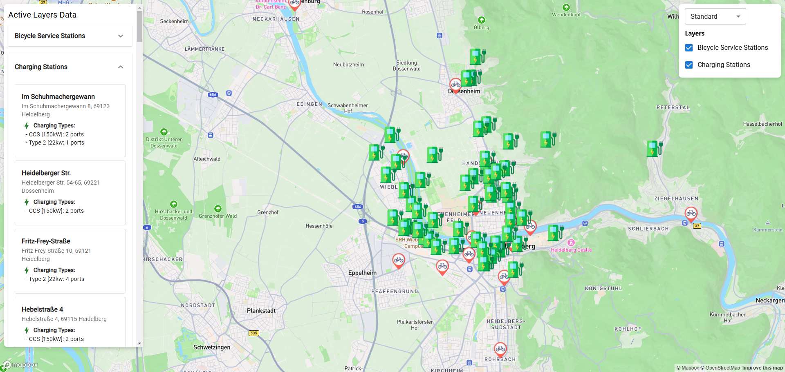

# Interactive Map with Deck.gl and Mapbox

This project is a **React-based interactive map** that uses **Deck.gl** and **Mapbox** to visualize geospatial data. It allows users to **switch between different map styles, toggle layers, and zoom into specific locations** using a sidebar menu.

## ** Features**
- 📍 **Layer Management**: Toggle visibility for different layers.
- 🔍 **Zoom to Feature**: Click on a location in the list to zoom into it.
- 🗺️ **Custom Map Styles**: Switch between multiple Mapbox styles.
- 🎯 **Highlighted Feature on Selection**: The selected item appears **larger** on the map for better visibility.
- 🏢 **Data Visualization**: Displays **bicycle service stations and charging stations** with detailed information.
- 🌐 **Fully Interactive**: Uses **Deck.gl** for optimized rendering and interaction.

---

